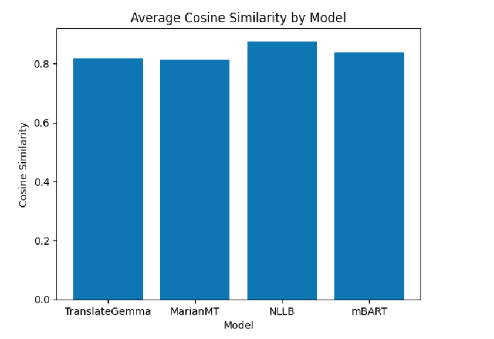
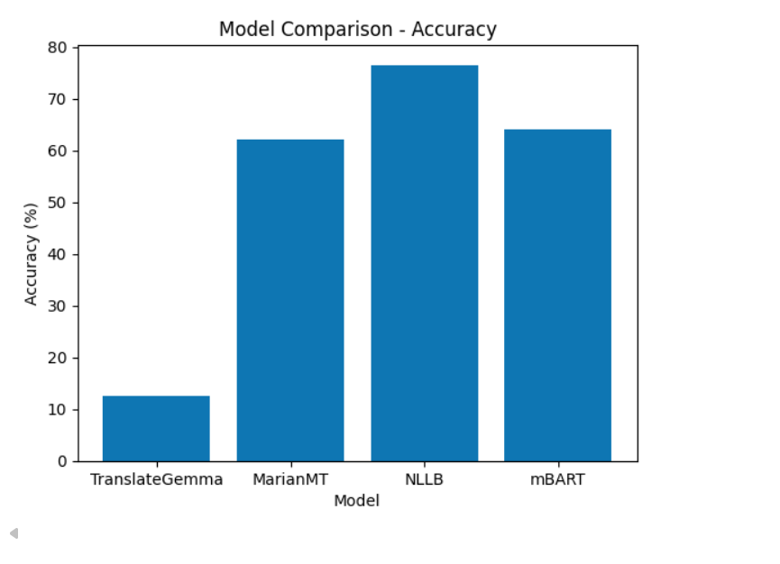
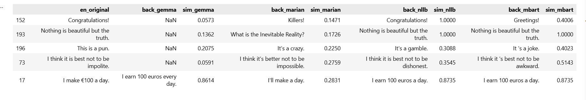
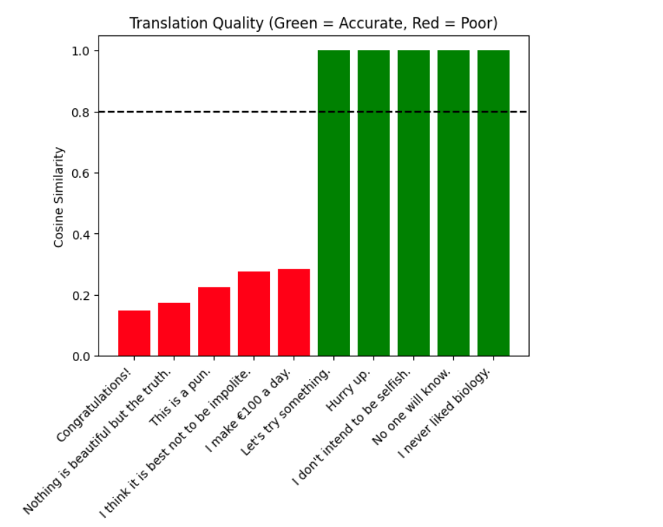
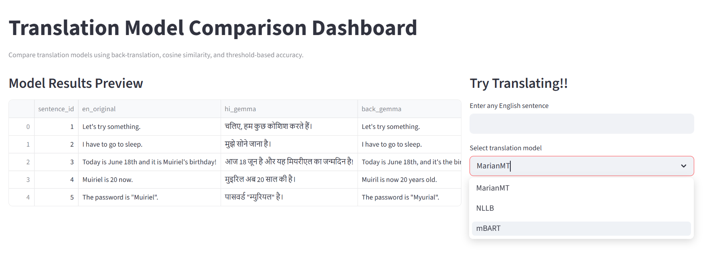
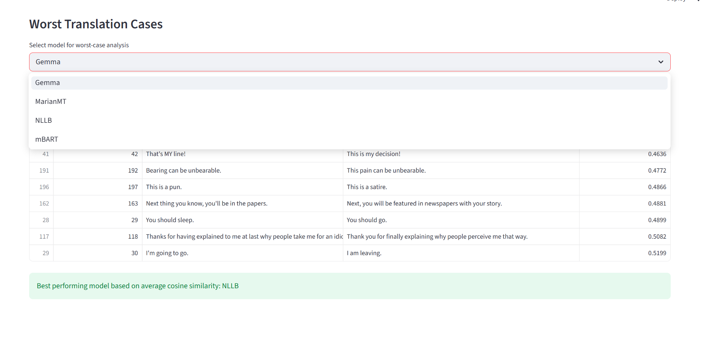

Bhavana Manda- Data Science 

#  Translation Model Comparison (English ↔ Hindi)


##  Overview

This project evaluates multiple neural machine translation models by performing **English → Hindi → English (back-translation)** and analyzing how well each model preserves the original meaning.

The focus is not only on accuracy but also on **performance trade-offs**, including runtime and model complexity.


---

##  Objectives

* Compare translation quality across models
* Measure semantic preservation using cosine similarity
* Analyze accuracy using a defined threshold
* Evaluate runtime efficiency
* Understand how model architecture affects performance

---


---

##  Methodology

###  Pipeline

1. Input English sentences
2. Translate → Hindi
3. Back-translate → English
4. Compare original vs back-translated text

---

##  Evaluation Metrics

### 🔹 Cosine Similarity

Measures **semantic similarity** between original and back-translated sentence using sentence embeddings.

* Range: `0 → 1`
* Closer to `1` = better meaning preservation

---

### 🔹 Accuracy (Threshold-Based)

A prediction is considered **correct** if:

```text
Cosine Similarity ≥ 0.80
```

This converts similarity into a binary evaluation:

* 1 → Accurate
* 0 → Not accurate

---

##  Results Summary

| Model           | Avg Cosine Similarity | Accuracy (%) |
|----------------|----------------------|--------------|
| TranslateGemma | 0.81                 | 62.0%        |
| MarianMT       | 0.81                 | 62.0%        |
| NLLB           | 0.87                 | 76.5%        |
| mBART          | 0.84                 | 64.0%        |


 **NLLB achieved the best overall performance**


---

##  Runtime Analysis

| Model          | Runtime | Observations                                        |
| -------------- | ------- | --------------------------------------------------- |
| TranslateGemma | 12 min  | Slow due to local LLM inference and no optimization |
| MarianMT       | 2 min   | Fastest due to optimized translation architecture   |
| NLLB           | 8 min   | Balanced performance and accuracy                   |
| mBART          | 7 min   | Slightly slower due to multilingual complexity      |

---

##  Parameter & Performance Insights

##  Model Parameters Summary

| Model           | Type                | Parameters | Architecture        | Source                   |
|----------------|---------------------|------------|---------------------|----------------------------|
| TranslateGemma | LLM (General)       | ~4 Billion | Decoder Transformer | Ollama                     |
| MarianMT       | NMT (Specialized)   | ~300M–600M | Encoder–Decoder     | Helsinki-NLP (HuggingFace) |
| NLLB           | Multilingual MT     | ~1.3B–3.3B | Encoder–Decoder     | Meta (Facebook AI)         |
| mBART          | Multilingual MT     | ~610M      | Encoder–Decoder     | Meta (Facebook AI)         |

---

### 🔹 Why Parameters Affect Accuracy

* More parameters → better ability to capture:

  * grammar
  * context
  * cultural meaning

BUT:

* More parameters → slower runtime
* Higher memory usage
* Increased computational cost

---

### 🔹 Why Runtime Differs

| Factor              | Impact                                  |
| ------------------- | --------------------------------------- |
| Model size          | Larger → slower                         |
| Architecture        | Optimized MT models (Marian) are faster |
| Hardware usage      | CPU vs GPU affects speed                |
| Tokenization method | Complex models take longer              |

---

##  Error Analysis (Key Observations)

* Named entities sometimes changed (e.g., “Muriel” → “Muller”)
* Informal phrases were poorly translated
* Some models introduced semantic drift
* Literal translation vs contextual meaning varied across models




##  Model Best and Worst Visualization

This plot shows cosine similarity scores for selected sentences.  
Green indicates high-quality translations, while red indicates poor translations.


---


## Dashboard 

An interactive Streamlit dashboard was developed to visualize model performance and demonstrate real-time translation.


### Features
- Model comparison using cosine similarity and accuracy
- Visualizations 
- Worst-case analysis of translations
- Live translation demo with back-translation and similarity score



##  Project Structure

```
translation-model-comparison/                         
│                                                        
├── data/                                                                
├── notebooks/                                      
├── results/                       
├── .gitignore                                                         
├── README.md                             
├── requirements.txt             
```

##  Future Improvements

* Add BLEU / ROUGE evaluation metrics
* Fine-tune models on domain-specific data
* Use GPU acceleration for faster inference
* Train custom translation model

---

## Technologies Used

- Python  
- Pandas  
- Hugging Face Transformers  
- SentenceTransformers  
- Scikit-learn  
- Streamlit 

---


---

##  Key Takeaway

This project highlights the **trade-off between accuracy and efficiency** in machine translation systems and demonstrates how model architecture and scale directly impact real-world performance.
